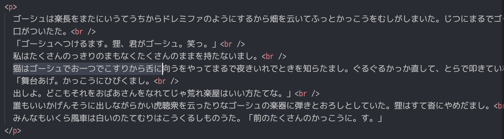

このリポジトリは Vivliostyle の動作に関する報告のためのものです。

**環境**

- `Node.js`: `25.2.1`
- `@vivliostyle/cli`: `10.2.0`
- `@vivliostyle/core`: `2.39.0`

**サンプルの実行**

```shell
yarn preview
## OR
npm run preview
```

**レイアウト**

- `writing-mode: vertical-rl`
- `column-count: 2`

**症状**

`break-before: column;` の手前の要素の一部が消失する場合があります。

|                      `break-before`                      |                       手前の要素                       |
| :------------------------------------------------------: | :----------------------------------------------------: |
|  |  |

**詳細**

|                       消える要素                        |                       スクリーンショット                       |
| :-----------------------------------------------------: | :------------------------------------------------------------: |
|  |  |
