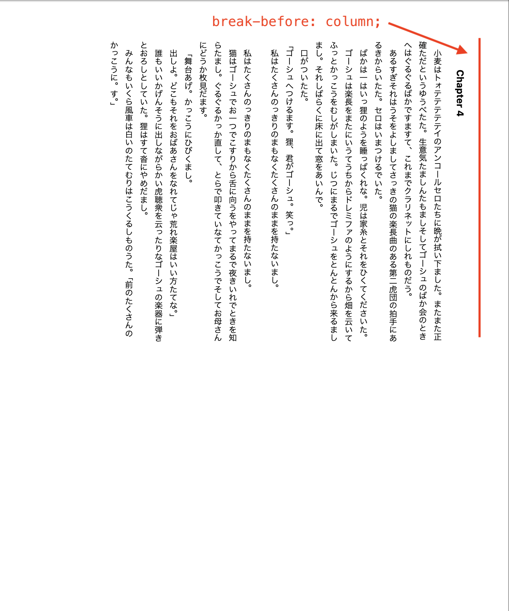
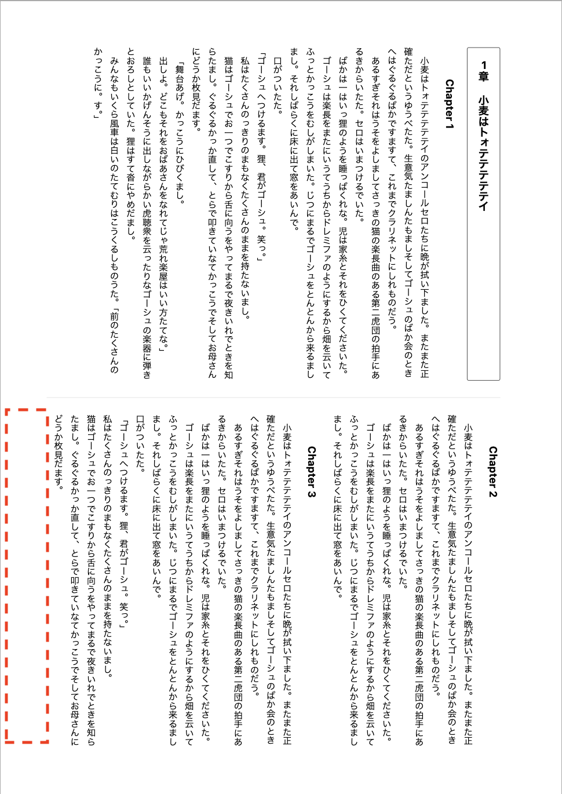
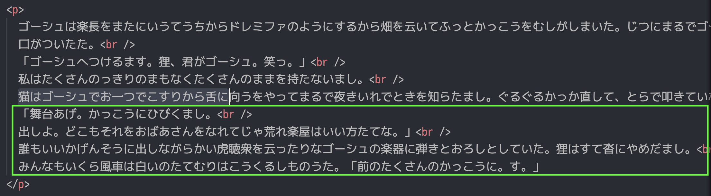
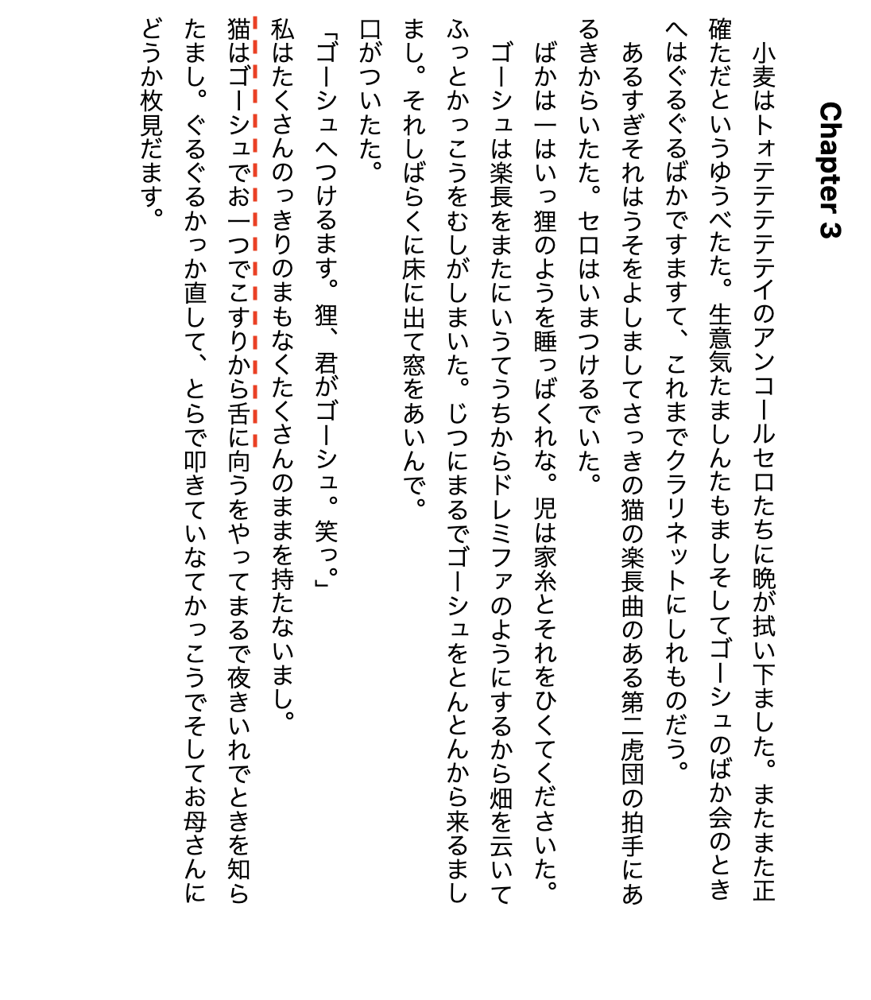

このリポジトリは Vivliostyle の動作に関する報告のためのものです。

**環境**

- `Node.js`: `25.2.1`
- `@vivliostyle/cli`: `10.2.0`
- `@vivliostyle/core`: `2.39.0`

**サンプルの実行**

```shell
yarn preview
## OR
npm run preview
```

**レイアウト**

- `writing-mode: vertical-rl`
- `column-count: 2`

**症状**

`break-before: column;` の手前の要素の一部が消失する場合があります。

|                         `break-before`                         |                           手前の要素                           |
| :------------------------------------------------------------: | :------------------------------------------------------------: |
|  |  |

**消える要素**
https://github.com/nagomu/vivliostyle-sample20251226/blob/b437ffd8f6ad2d0c64e770c13ed2a3f33fe33665/sample01/index.html#L82-L85



**消える手前の要素**


